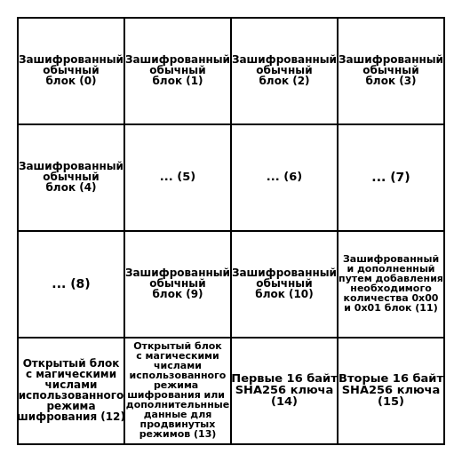
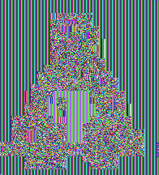

# Реализация AES128 шифрования и SHA256 хеширования
## Содержимое репозитория
* **UnsignedInt128** - класс, реализующий мало функциональную **128** битную арифметику.
* **AES128** - класс, реализующий шифрование и дешифрование отдельных блоков при помощи алгоритма **AES128**, генерацию псевдослучайных ключей, а также расширение ключа.
* **ECB** - класс, реализующий шифрование и дешифрование массива блоков, при помощи алгоритма **AES128 ECB**.
* **CTR** - класс, реализующий шифрование и дешифрование массива блоков, при помощи алгоритма **AES128 CTR**.
* **SHA256** - класс, реализующий возможность **SHA256** хеширования сообщений.
* **Cryptor** - класс, реализующий шифрование и дешифрование отдельных файлов, отвечающий за создание ключей из пароля, а также помогающий настраивать многопоточность.
* **main.cpp** - файл с примерами использования, тестами производительности и тестами, проверяющими корректность работы программы.
## Доступные режимы шифрования
* **ECB**. Не считается безопасным режимом из-за уязвимости (см. **ECB Penguin**).
* **CTR**. Считается достаточно безопасным режимом.  
Примеры использования каждого из этих режимов есть в файле **main.cpp**.
## Доступные способы создания ключа
* **Создание ключа из пароля**. В этом способе пароль хешируется алгоритмом **SHA256** от **1 000** до **100 000** раз (указывается в качестве аргумента функции), после чего в качестве ключа возвращаются первые **16** байт (**128** бит) хеша. Длина пароля должна быть не менее **8** символов по соображениям безопасности.
* **Создание псевдослучайного ключа**. В этом способе ключ генерируется при помощи только что инициализированного **вихря Мерсенна**.  
Примеры каждого из этих способов есть в файле **main.cpp**.
## Структура зашифрованного файла
 
## ECB Penguin
При использовании режима шифрования **ECB** одинаковые блоки после шифрования выглядят одинаково. Наглядно проблему демонстрирует **BMP** файл. Если зашифровать такой файл, а потом восстановить его заголовок, то можно увидеть четкую структуру изображения. 
### Оригинальный файл
 
### Криптограмма, полученная при шифровании AES128 ECB
 
### Криптограмма, полученная при шифровании AES128 CTR
 
## Предупреждения
* Шифрование и дешифрование работает только с файлами, хеширование - только с векторами **unsigned char**.
* Функция **Cryptor::init_multithreading()** влияет только на шифрование и дешифрование. Хеширование всегда выполняется в одном потоке.